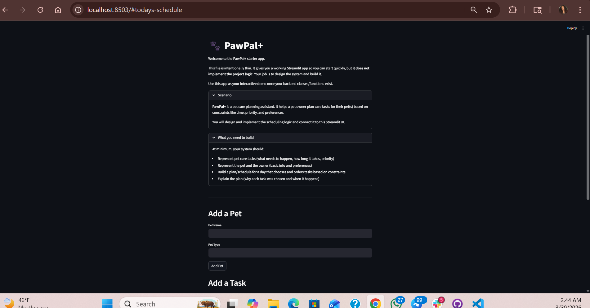

# PawPal+ (Module 2 Project)

You are building **PawPal+**, a Streamlit app that helps a pet owner plan care tasks for their pet.

## Scenario

A busy pet owner needs help staying consistent with pet care. They want an assistant that can:

- Track pet care tasks (walks, feeding, meds, enrichment, grooming, etc.)
- Consider constraints (time available, priority, owner preferences)
- Produce a daily plan and explain why it chose that plan

Your job is to design the system first (UML), then implement the logic in Python, then connect it to the Streamlit UI.

## What you will build

Your final app should:

- Let a user enter basic owner + pet info
- Let a user add/edit tasks (duration + priority at minimum)
- Generate a daily schedule/plan based on constraints and priorities
- Display the plan clearly (and ideally explain the reasoning)
- Include tests for the most important scheduling behaviors

## Getting started

### Setup

```bash
python -m venv .venv
source .venv/bin/activate  # Windows: .venv\Scripts\activate
pip install -r requirements.txt
```

### Suggested workflow

1. Read the scenario carefully and identify requirements and edge cases.
2. Draft a UML diagram (classes, attributes, methods, relationships).
3. Convert UML into Python class stubs (no logic yet).
4. Implement scheduling logic in small increments.
5. Add tests to verify key behaviors.
6. Connect your logic to the Streamlit UI in `app.py`.
7. Refine UML so it matches what you actually built.

## Smarter Scheduling

This system includes:
- Sorting tasks by time using datetime parsing
- Filtering tasks by completion status and pet
- Basic conflict detection for tasks scheduled at the same time
- Simple recurring task handling for daily and weekly tasks

## Features

- Add pets and tasks through a Streamlit UI
- Tasks are sorted by time using datetime parsing
- Priority scheduling: High, Medium, Low
- Filter tasks by completion status
- Detect scheduling conflicts when tasks share the same time
- Basic recurring task support

## Advanced Feature: Priority Scheduling

Tasks are prioritized using a weighted system (High, Medium, Low).
The scheduler sorts tasks by priority first, then by time.

Agent Mode was used to help design the sorting logic and ensure a clean, readable implementation.

## 📸 Demo


## Testing PawPal+

Run tests using:
```bash
python -m pytest
```

Tests cover:
- Task completion
- Adding tasks
- Sorting
- Conflict detection

Confidence Level: ⭐⭐⭐⭐☆ (4/5)
